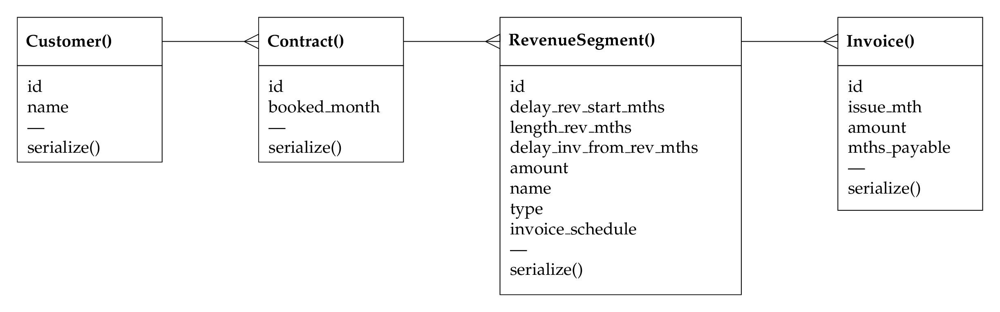

# Revbot - Revenue Recognition Concept API

## Goals

Create environment with API endpoints for creating and managing customers, contracts, revenue segments and invoices in a SaaS-like construct.

Interface with an LLM enabling natural language specification of revenue contracts and demonstrate the translation to an accounting ledger with compliant revenue recognition. See https://github.com/birchpoplar/revbot_agent for working prototype, using the https://www.fixie.ai/ platform.

## Status

**Backend** - Flask API, operational although very limited validation checking or testing

**Frontend** - React, not operational

## Main Definitions

- **Customer** Simple customer with name
- **Contract** Linked to a customer, specifies `booked_month`, which is the month (as integer) in which a contract is booked
- **RevenueSegment** Linked to a contract. A RevenueSegment comprises a revenue recognition schedule and associated invoices.
- **Invoice** Linked to a RevenueSegment.

## Database Relationships

The four main database classes are related as shown below:

## Populate Dataframe

Objects are created and linked together. A `populate_dataframe` function builds a Pandas dataframe that shows the following in a typical financial statement format:
- TCV, Total Contract Value
- Rev, Revenue
- DefRev, Deferred Revenue
- UnbilledRev, Unbilled Revenue
- AR, Accounts Receivable
- Cash, Cash

## Database Implementations

The `DevelopmentConfig` is for a localhost PostgreSQL database. The `TestingConfig` can use that or a temporary sqlite config.

Next step: cloud-hosted, probably Heroku, for `ProductionConfig`.

## API Definitions

See [here](docs/api.md).

## Some Configuration Notes

### PostGRES SQL - create local database

Here are the general steps to create a user and database with PostgreSQL:

`sudo -u postgres psql`

Create a new database (replace "mydatabase" with your desired database name):

`CREATE DATABASE mydatabase;`

Create a new user (replace "myuser" with your desired username and "mypassword" with your desired password):

`CREATE USER myuser WITH ENCRYPTED PASSWORD 'mypassword';`

Grant all privileges on the database to the new user:

`GRANT ALL PRIVILEGES ON DATABASE mydatabase TO myuser;`

Exit the PostgreSQL command line interface:

`\q`
